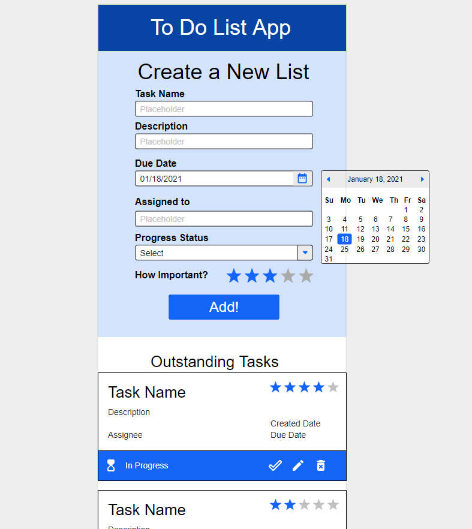
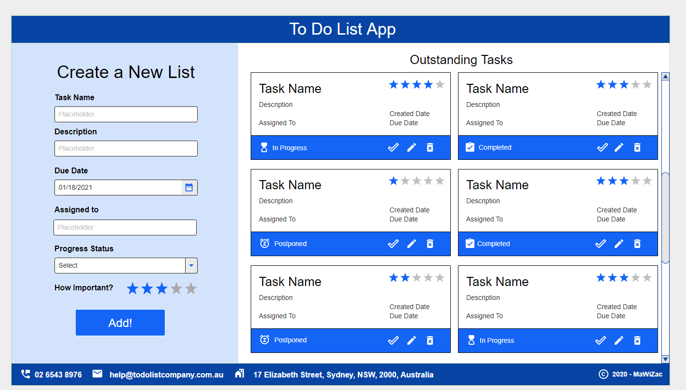
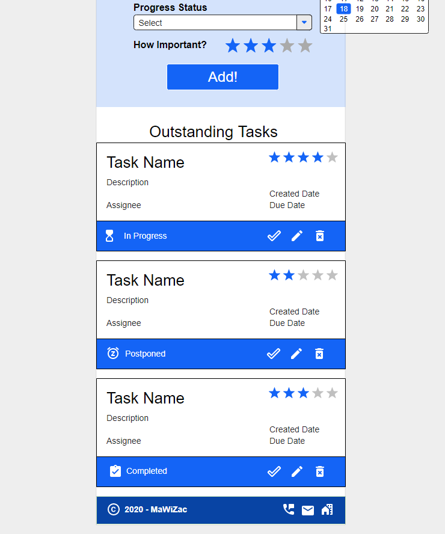

# jwd4-final-project

### Task Description
This is the final project of Generation Australia's 12 weeks bootcamp, creating a task app using HTML, CSS, JavaScript, Bootstrap, and Mocha/Chai for unit testing.

### Instruction
1. Adding a Task
   User can add new task via the left side form by entering the task name, description, due date and the assignee name as well as the importance rating for the task. By default, rating will be 1 if not selected.

2. Mark a Task as complete
   User can mark the task as complete by clicking on the 'check/tick' in the task card window.

3. Deleting a Task
   User can delete the task by clicking on the 'trashcan' button in the task card window.

## Wire Frames
| Screenshots         |              Mobile            |           Desktop             |
| ------------------- |:------------------------------:| ----------------------------- | 
| Home - Top          |  |  | 
| Home - Bottom       |  |  |

## Team members
This project is created by:
- Manami Davidson
- Zachary Guest
- Willy Sufianto
- Zoe Shi
